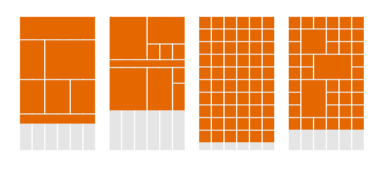

# Microverse Project Title - Design Your Own Grid-based Framework [Collaborative Project]

### Snapshot

## Description
This assignment consists of building a grid-based framework (similar to bootstrap) that includes some basic functionality necessary to build a website.

## Project Specific
Responsiveness;

- Breakpoint for small screens with a width of up to 720px
- Breakpoint for medium screens with a width in the range of 720px - 1024px
- bBeakpoint for large screens with width above 1024px

## Steps
Applying the Framework

1. Create a new HTML document and a new Github repository.

2. Identify the webpage you’d like to clone and break it down into its major elements like we have in the previous projects.

3. Add your framework to your project.

4. Use your framework to lay out the structure of the page.

5. Fill in the necessary details/images etc.

6. Push your solution to Github.

#### Getting Started
Clone repo and run index.html

## SASS Structure

|– dgstrap.scss			// Compiled from below
|   |– _block.scss
|   |– _fonts.scss
|   |– _grids.scss
|   |– _spacing.scss

|– styles.css			// Compiled from below
|   |– SASS/styles.scss

|– dgstrap.css			// Compiled from below
|   |– SASS/dgstrap.scss

* [Live preview](https://rawcdn.githack.com/davitomix/CustomGridFrameWork/b5320d1646cea5bc2e0e9bdbcfe881e37083e70f/index.html)

## Future Enhancement

None 

## Source
https://www.theodinproject.com/courses/html5-and-css3/lessons/design-your-own-grid-based-framework

## Github Repo
https://github.com/davitomix/CustomGridFrameWork

## Contributors
David Martinez [GitHub](https://github.com/davitomix) 
Gerald Goh [GItHub](https://github.com/geraldgsh/)
